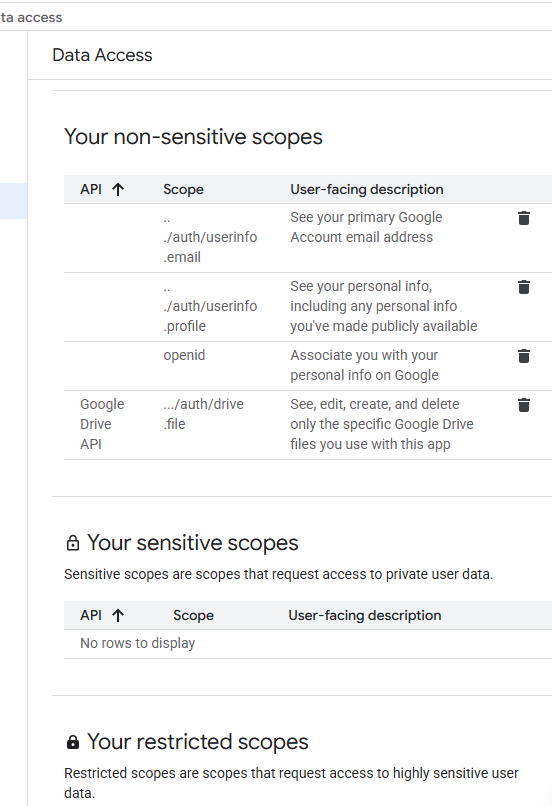

# React Web Camera

A lightweight and flexible React component for capturing images from the user’s camera (front or back) with support for `jpeg`, `png`, and `webp` formats. Built with modern React (`hooks` + `forwardRef`) and works on both desktop and mobile browsers.

## Table of Contents

- [Why?](#why-)
- [Our Solution](#our-solution-)
- [Features](#features-)
- [Installation](#installation-)
- [Usage](#usage-)
  - [Basic Example](#basic-example)
  - [Vite.js Example](#vitejs-example)
  - [Next.js Example (App Router)](#nextjs-example-app-router)
  - [PWA Example](#pwa-example)
- [Props](#props-%EF%B8%8F)
- [Ref Methods](#ref-methods-)
- [Notes](#notes-%EF%B8%8F)
- [License](#license-)
- [Contact](#contact-)

---
## Auth Client setup

## MileStone （Dec 4, 2025)
--12/04- multiple images+text for ONE GPT completion
--12/04- 使用next-auth, 關鍵 auth.js + content.tsx

## Remote prompts (Dec 3. 2025 接下來要 nextauth)

The `/api/summarize` route expects a `prompts.json` file hosted at a reachable URL (for example, a Google Drive "anyone with the link" file). Set `PROMPTS_URL` to the download URL and deploy. The JSON should include the following fields:

```json
{
  "system": "You are a meticulous document reader...",
  "user": "Summarize the document content in about {{wordTarget}} words...",
  "wordTarget": 120
}
```

An example file lives at `prompts.example.json`. Copy it to Google Drive, share it publicly, and set `PROMPTS_URL` accordingly. If the URL cannot be fetched at runtime, the API falls back to a built-in summarization prompt.


## Why?

Capturing multiple images from a webcam is a common need in modern web apps, especially Progressive Web Apps (PWAs).
Existing solutions are often:

- Single-shot only (cannot capture multiple images)
- Bloated or heavy
- Hard to customize UI or styling
- Not fully compatible with PWAs or mobile browsers

**Problem with `<input type="file" capture>` on mobile:**  
When you use a file input like:

```html
<input type="file" accept="image/*" capture="environment" />
```

on phones, it only allows **a single photo capture**. After you take one photo, the camera closes, and to capture another, the user must reopen the camera again.  
This creates a poor user experience for apps needing **multi-photo sessions** (for example: KYC verification, delivery apps, or documentation workflows).

---

## Our Solution

`react-web-camera` provides a headless, platform-independent React component that gives you full control over your UI. It handles the complex logic of accessing the webcam, capturing multiple images, and managing state, while you focus on styling and user experience.

This makes it:

- **Lightweight** – minimal overhead for fast, responsive apps
- **Flexible** – integrate seamlessly with your design system
- **Multi-Image Ready** – capture and manage multiple photos in a single session

---

## Features

- **📷 Front & Back Camera Support** – Easily capture images from both cameras.
- **🖼 Multiple Image Formats** – Export images as jpeg, png, or webp.
- **⚡ Adjustable Capture Quality** – Control image quality with a range of 0.1–1.0.
- **🔄 Camera Switching** – Seamlessly switch between front (user) and back (environment) cameras.
- **📸 Multi-Image Capture** – Click and manage multiple pictures within a session on both web and mobile.
- **🎯 Camera Ready on Mount** – Access the camera instantly when the component loads.
- **🛠 Full Programmatic Control** – Use ref methods like capture(), switch(), and getMode().
- **🎨 Custom Styling** – Style the container and video element to match your design system.

---

## Installation

```bash
# If using npm
npm install @shivantra/react-web-camera
```

```bash
# Or with yarn
yarn add @shivantra/react-web-camera
```

```bash
# Or with pnpm
pnpm add @shivantra/react-web-camera
```

---

## Usage

- **Basic Example**

```tsx
import React, { useRef } from "react";
import { WebCamera, WebCameraHandler } from "@shivantra/react-web-camera";

function App() {
  const cameraHandler = useRef<WebCameraHandler>(null);
  const [images, setImages] = useState<string[]>([]);

  async function handleCapture() {
    const file = await cameraHandler.current?.capture();
    if (file) {
      const base64 = await fileToBase64(file);
      setImages((_images) => [..._images, base64]);
    }
  }

  function handleSwitch() {
    cameraHandler.current?.switch();
  }

  return (
    <div>
      <div style={{ display: "flex", gap: 5 }}>
        <button onClick={handleCapture}>Capture</button>
        <button onClick={handleSwitch}>Switch</button>
      </div>
      <div>
        <WebCamera
          style={{ height: 500, width: 360, padding: 10 }}
          videoStyle={{ borderRadius: 5 }}
          captureMode="back"
          ref={cameraHandler}
        />
      </div>
      <div style={{ display: "flex", flexWrap: "wrap", gap: 5 }}>
        {images.map((image, ind) => (
          
        ))}
      </div>
    </div>
  );
}
```

- **Vite.js Example**

```tsx
import React from "react";
import ReactDOM from "react-dom/client";
import { WebCamera } from "@shivantra/react-web-camera";

function App() {
  return (
    <div>
      <h1>📸 Vite + Webcam</h1>
      <WebCamera
        style={{ width: 320, height: 480, padding: 10 }}
        videoStyle={{ borderRadius: 5 }}
        className="camera-container"
        videoClassName="camera-video"
        captureMode="front"
        captureType="png"
        getFileName={() => `vite-photo-${Date.now()}.jpeg`}
      />
    </div>
  );
}

ReactDOM.createRoot(document.getElementById("root")!).render(<App />);
```

- **Next.js Example (App Router)**

```tsx
"use client";

import { WebCamera } from "@shivantra/react-web-camera";

export default function CameraPage() {
  return (
    <main>
      <h1>📸 Next.js Webcam Example</h1>
      <WebCamera
        style={{ width: 320, height: 480, padding: 10 }}
        videoStyle={{ borderRadius: 5 }}
        className="camera-container"
        videoClassName="camera-video"
        captureMode="front"
        getFileName={() => `next-photo-${Date.now()}.jpeg`}
        onError={(err) => console.error(err)}
      />
    </main>
  );
}
```

- **PWA Example**

```tsx
import { WebCamera } from "@shivantra/react-web-camera";

export default function PWAApp() {
  return (
    <div>
      <h2>📱 PWA Webcam Ready</h2>
      <WebCamera
        style={{ width: 320, height: 480, padding: 10 }}
        videoStyle={{ borderRadius: 5 }}
        className="camera-container"
        videoClassName="camera-video"
        captureMode="back"
        captureType="jpeg"
        captureQuality={0.8}
        getFileName={() => `pwa-photo-${Date.now()}.jpeg`}
        onError={(err) => console.error(err)}
      />
    </div>
  );
}
```

> ✅ Works on mobile browsers and when installed as a PWA (HTTPS required for camera access).

---

## Props ⚙️

| Prop             | Type                            | Default  | Description                                      |
| ---------------- | ------------------------------- | -------- | ------------------------------------------------ |
| `className`      | `string`                        | —        | CSS class for the wrapper `<div>`                |
| `style`          | `React.CSSProperties`           | —        | Inline styles for the wrapper `<div>`            |
| `videoClassName` | `string`                        | —        | CSS class for the `<video>` element              |
| `videoStyle`     | `React.CSSProperties`           | —        | Inline styles for the `<video>` element          |
| `getFileName`    | `() => string`                  | —        | Optional function to generate captured file name |
| `captureMode`    | `"front"` \| `"back"`           | `"back"` | Initial camera mode                              |
| `captureType`    | `"jpeg"` \| `"png"` \| `"webp"` | `"jpeg"` | Image format for capture                         |
| `captureQuality` | `0.1`–`1.0`                     | `0.8`    | Image quality for capture                        |
| `onError`        | `(err: Error) => void`          | —        | Callback for camera errors                       |

---

## Ref Methods

Access these methods via `ref`:

| Method      | Description                                                    |
| ----------- | -------------------------------------------------------------- |
| `capture()` | Captures an image from the camera and returns a `File` object. |
| `switch()`  | Switches between front and back cameras.                       |
| `getMode()` | Returns current camera mode: `"front"` or `"back"`.            |

---

## Notes

- On mobile devices, some browsers may require HTTPS to access the camera.
- Ensure the user grants camera permissions; otherwise, the component will throw an error.
- `videoStyle` and `style` are independent — `videoStyle` only affects the video element, `style` affects the container.

---

## License

MIT License © 2025 Shivantra Solutions Private Limited

---

## Contact

For more details about our projects, services, or any general information regarding **react-web-camera**, feel free to reach out to us. We are here to provide support and answer any questions you may have. Below are the best ways to contact our team:

**Email:** Send us your inquiries or support requests at [contact@shivantra.com](mailto:contact@shivantra.com).  
**Website:** Visit our official website for more information: [Shivantra](https://shivantra.com).

**Follow us on social media for updates:**

- **LinkedIn:** [Shivantra](https://www.linkedin.com/company/shivantra)
- **Instagram:** [@Shivantra](https://www.instagram.com/shivantra/)
- **Github:** [Shivantra](https://www.github.com/shivantra/)

We look forward to assisting you and ensuring your experience with **react-web-camera** is smooth and enjoyable!
